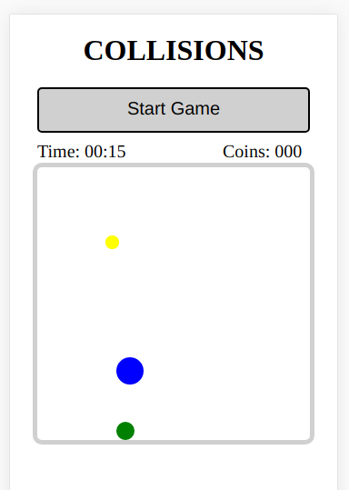

# PhoneGap App: Collision 

PhoneGap app that uses the accerelometer of the mobile phone.

## Gameplay

There are three dots in this game:
* Green dot: This is you. By moving your phone to the right and left or up and down this dot moves to the corresponding direction.
* Yellow dot: This dot is not moving. With the green dot you try to catch the yellow dots. If you touch one it disappears and reappears in a different spot. For each dot you catch you receive one coin.
* Blue dot: This dot is following you and trying to catch you. If it catches you the game is over. The longer you survive the faster the blue dot gets.

Try to survive as long as possible and collect as many coins as you can!

## Usage

This is a mobile game. You need PhoneGap installed on your PC and your (android) mobile phone. On your PC start a PhoneGap server and insert the id of your server in PhoneGap on your mobile phone.

If you don't have an android mobile phone this game cannot be played. But you can still open the /www/index.html in your browser. The DevTools of Chromium allow you to simulate the orientation of a mobile phone. But it cannot recommend playing this game like that.

    

